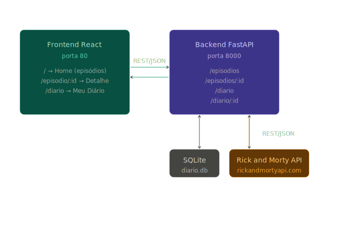

# Diário de Episódios — Rick & Morty (Frontend)

Aplicação React para gerenciar um diário pessoal de episódios da série **Rick and Morty**. Permite navegar por episódios, ver personagens e registrar anotações e avaliações pessoais.

---

## Arquitetura



```
┌──────────────────────────┐        REST/JSON        ┌──────────────────────────┐
│  Frontend React (porta 80) │ ──────────────────────► │  Backend FastAPI (porta  │
│                            │                          │  8000)                   │
│  / → Home (episódios)      │ ◄────────────────────── │                          │
│  /episodio/:id → Detalhe  │                          │  /episodios              │
│  /diario → Meu Diário     │                          │  /diario                 │
└──────────────────────────┘                          └──────────┬───────────────┘
                                                                 │
                                                    ┌────────────▼────────────┐
                                                    │  Rick and Morty API     │
                                                    │  rickandmortyapi.com    │
                                                    └──────────────────────���──┘
```

---

## Pré-requisitos

- Node.js 18+ e npm
- Backend rodando em `http://localhost:8000` (ver repositório do backend)
- Docker (opcional)

---

## Como rodar localmente

### Sem Docker

```bash
# 1. Clone o repositório
git clone <url-do-repo>
cd back-avancado-mvp-frontend

# 2. Instale as dependências
npm install

# 3. Configure as variáveis de ambiente
cp .env.example .env
# Edite .env se necessário

# 4. Inicie o servidor de desenvolvimento
npm run dev
```

A aplicação estará disponível em: **http://localhost:5173**

### Com Docker (apenas frontend)

```bash
# Build e run
docker build --build-arg VITE_API_URL=http://localhost:8000 -t rickmorty-front .
docker run -p 80:80 rickmorty-front
```

### Com Docker Compose (frontend + backend juntos)

```bash
# Na raiz deste repositório
docker-compose up --build
```

- Frontend: **http://localhost:80**
- Backend: **http://localhost:8000**
- Swagger: **http://localhost:8000/docs**

---

## Variáveis de ambiente

| Variável       | Padrão                  | Descrição                          |
|----------------|-------------------------|------------------------------------|
| `VITE_API_URL` | `http://localhost:8000` | URL base do backend FastAPI        |

> Crie um arquivo `.env` na raiz do projeto baseado no `.env.example`.

---

## Páginas

| Rota              | Protegida | Página          | Descrição                                              |
|-------------------|-----------|-----------------|--------------------------------------------------------|
| `/`               | Não       | Home            | Grade de episódios com paginação                       |
| `/login`          | Não       | Login           | Formulário de autenticação                             |
| `/register`       | Não       | Registrar       | Formulário de cadastro de novo usuário                 |
| `/episodio/:id`   | Sim       | Episode Detail  | Detalhes do episódio, personagens e formulário diário  |
| `/diario`         | Sim       | My Diary        | Lista de entradas com filtros, edição e exclusão       |

> Rotas protegidas redirecionam para `/login` se o usuário não estiver autenticado.

---

## Rotas HTTP utilizadas (chamadas ao backend)

| Método   | Rota                  | Auth         | Descrição                                    |
|----------|-----------------------|--------------|----------------------------------------------|
| `POST`   | `/auth/register`      | —            | Cadastra novo usuário                        |
| `POST`   | `/auth/login`         | —            | Faz login e obtém token JWT                  |
| `GET`    | `/auth/me`            | Bearer JWT   | Valida sessão ao carregar a aplicação        |
| `GET`    | `/episodios`          | —            | Lista episódios paginados                    |
| `GET`    | `/episodios/{id}`     | —            | Detalhes do episódio + personagens           |
| `GET`    | `/diario`             | Bearer JWT   | Lista entradas do diário do usuário          |
| `POST`   | `/diario`             | Bearer JWT   | Cria nova entrada no diário                  |
| `PUT`    | `/diario/{id}`        | Bearer JWT   | Atualiza nota/avaliação de uma entrada       |
| `DELETE` | `/diario/{id}`        | Bearer JWT   | Remove uma entrada do diário                 |

> O token JWT é armazenado no `localStorage` e injetado automaticamente em todas as requisições via interceptor do Axios.

---

## API Externa — Rick and Morty API

| Campo             | Valor                                             |
|-------------------|---------------------------------------------------|
| **Nome**          | The Rick and Morty API                            |
| **URL**           | https://rickandmortyapi.com                       |
| **Licença**       | MIT                                               |
| **Cadastro**      | Não necessário — API pública e gratuita           |
| **Autenticação**  | Nenhuma                                           |

> Os dados desta API são consumidos e tratados pelo **backend** (não pelo frontend diretamente).
> O frontend nunca faz chamadas para `rickandmortyapi.com` — todas as requisições passam pelo backend.

### Rotas da API externa utilizadas pelo backend

| Rota                                     | Descrição                              |
|------------------------------------------|----------------------------------------|
| `GET /api/episode?page={n}`              | Lista de episódios paginada            |
| `GET /api/episode/{id}`                  | Detalhes de um episódio específico     |
| `GET /api/character/{ids}`               | Dados de múltiplos personagens         |

---

## Estrutura de arquivos

```
src/
├── api/
│   └── api.js                  # Instância Axios + funções de API + interceptors JWT
├── context/
│   └── AuthContext.jsx         # Estado global de autenticação (AuthProvider + useAuth)
├── pages/
│   ├── Home.jsx                # Lista de episódios com paginação (pública)
│   ├── Login.jsx               # Formulário de login
│   ├── Register.jsx            # Formulário de cadastro
│   ├── EpisodeDetail.jsx       # Detalhe do episódio + formulário do diário (protegida)
│   └── MyDiary.jsx             # Diário completo com filtros e ações (protegida)
└── components/
    ├── Navbar.jsx              # Barra de navegação com estado de auth
    ├── ProtectedRoute.jsx      # Wrapper que redireciona para /login se não autenticado
    ├── EpisodeCard.jsx         # Card de episódio na grade
    ├── DiaryEntryForm.jsx      # Formulário de criar/editar entrada
    ├── DiaryEntryCard.jsx      # Card de entrada no diário
    └── StarRating.jsx          # Componente de avaliação por estrelas
```
